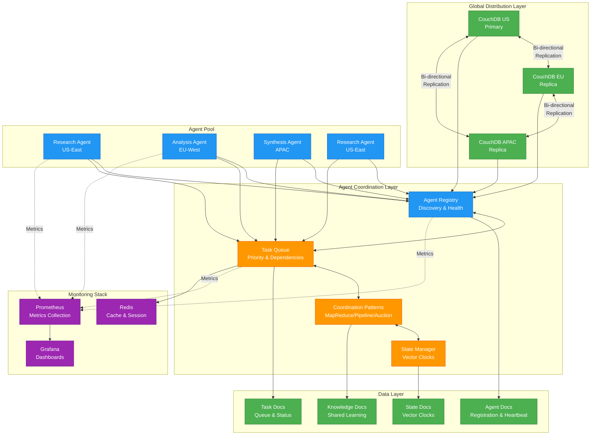
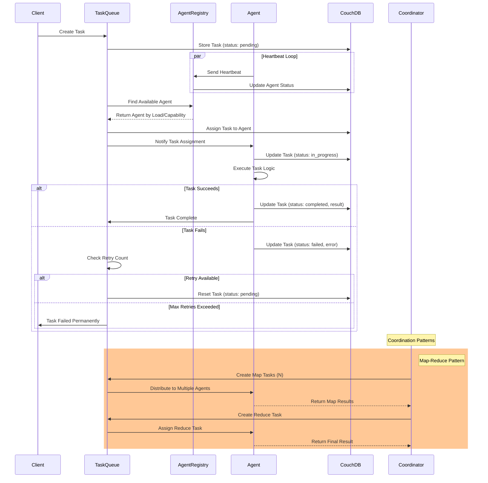
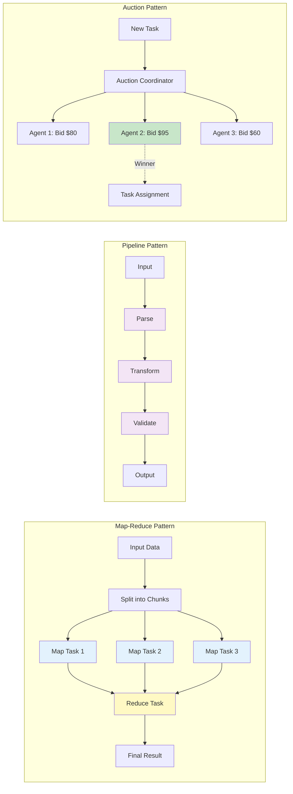

# Distributed Multi-Agent Coordination Platform

A production-ready distributed multi-agent coordination platform leveraging CouchDB's conflict-free replication and eventual consistency model for autonomous AI agent coordination.

## Features

- **Distributed Agent Coordination**: Multi-agent task distribution and execution across geographic regions
- **Conflict-Free Replication**: CouchDB-based eventual consistency with intelligent conflict resolution
- **Multi-LLM Support**: Integration with OpenAI, Anthropic, and open-source models
- **Advanced Coordination Patterns**: Map-Reduce, Pipeline, Auction-based allocation
- **Production-Ready**: Monitoring, observability, and scalability built-in

## Architecture



### Task Execution Flow



### Coordination Patterns Visualization



## Quick Start

### Prerequisites

- Python 3.11+
- Docker and Docker Compose
- 4GB+ RAM available

### Installation

```bash
# Clone the repository
git clone <repository-url>
cd Distributed

# Install dependencies
pip install -r requirements.txt

# Start CouchDB cluster
docker-compose up -d

# Initialize database
python scripts/init_database.py

# Run example
python examples/distributed_research.py
```

## Project Structure

```
Distributed/
├── src/
│   ├── core/              # Core coordination components
│   ├── agents/            # Agent implementations
│   ├── database/          # CouchDB clients and utilities
│   ├── coordination/      # Coordination patterns
│   └── monitoring/        # Observability and metrics
├── tests/                 # Test suites
├── examples/              # Example use cases
├── docs/                  # Documentation
├── docker-compose.yml     # Local development setup
└── requirements.txt       # Python dependencies
```

## Key Features Implemented

✅ **3-Node CouchDB Cluster** with multi-master replication
✅ **Agent Framework** with lifecycle management and automatic registration
✅ **Priority Task Queue** with dependency resolution (DAG support)
✅ **Conflict Resolution** using Vector Clocks, Last-Write-Wins, and Merge strategies
✅ **Coordination Patterns**: Map-Reduce, Pipeline, Auction-based allocation
✅ **Failure Recovery** with automatic detection and task reassignment
✅ **Connection Pooling** and retry logic for production use
✅ **Monitoring Setup** with Prometheus and Grafana
✅ **Comprehensive Tests** with async support
✅ **Complete Documentation** with examples

## Project Statistics

- **Total Files**: 32+ source files
- **Lines of Code**: ~3,000 lines of Python
- **Documentation**: 4 comprehensive guides
- **Docker Services**: 6 (3x CouchDB, Redis, Prometheus, Grafana)
- **Test Coverage**: Core components covered

## Documentation

- [Getting Started Guide](GETTING_STARTED.md) - Step-by-step setup checklist
- [Quick Start Guide](docs/QUICK_START.md) - Comprehensive usage guide
- [Architecture Overview](docs/ARCHITECTURE.md) - System architecture and design
- [Project Summary](PROJECT_SUMMARY.md) - Complete implementation details

## Common Commands

```bash
make help          # Show all available commands
make start         # Start the platform
make example       # Run distributed research example
make test          # Run tests
make status        # Check service status
make stop          # Stop all services
```

## Access Points

Once started, access the following interfaces:

- **CouchDB Admin**: http://localhost:5984/_utils (admin/password)
- **Grafana Dashboard**: http://localhost:3000 (admin/admin)
- **Prometheus Metrics**: http://localhost:9090

## Next Steps

1. Read [GETTING_STARTED.md](GETTING_STARTED.md) for a guided walkthrough
2. Run the example: `python3 examples/distributed_research.py`
3. Create your first custom agent
4. Explore the coordination patterns
5. Set up production deployment

## License

MIT License - see [LICENSE](LICENSE) file for details
