# System Diagrams

This document contains visual diagrams of the Distributed Multi-Agent Coordination Platform architecture and workflows.

## Table of Contents
- [System Architecture](#system-architecture)
- [Agent Lifecycle](#agent-lifecycle)
- [Task Flow](#task-flow)
- [Map-Reduce Coordination](#map-reduce-coordination)
- [Conflict Resolution](#conflict-resolution)
- [Data Model](#data-model)

---

## System Architecture

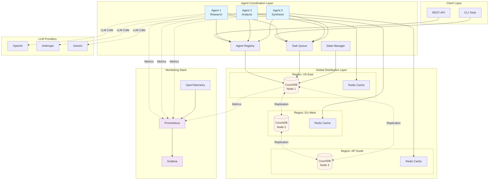

---

## Agent Lifecycle

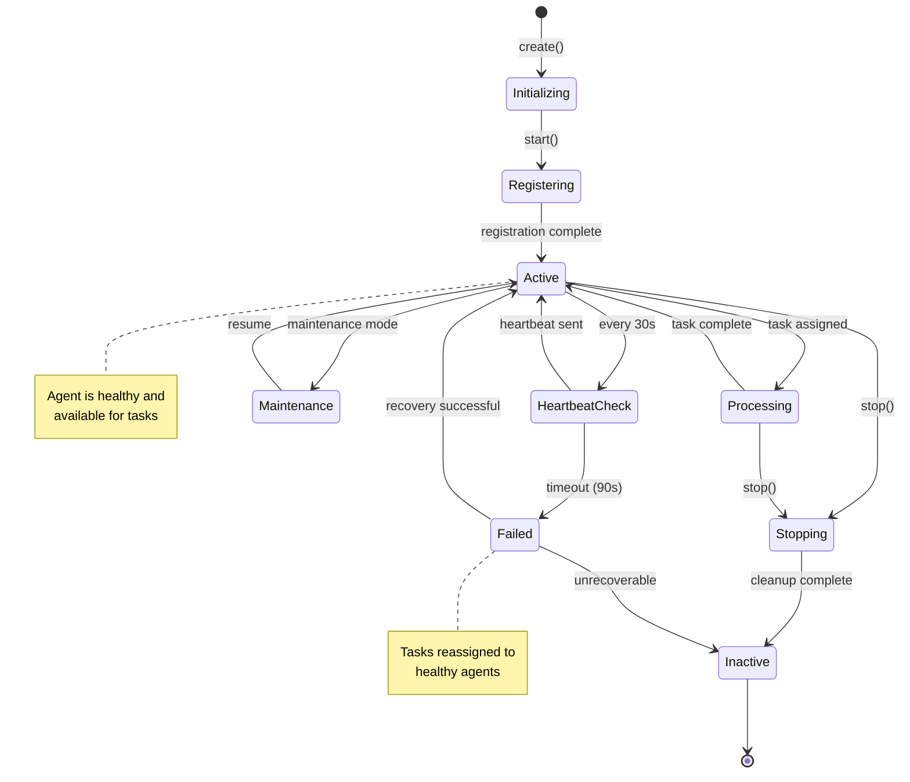

---

## Task Flow

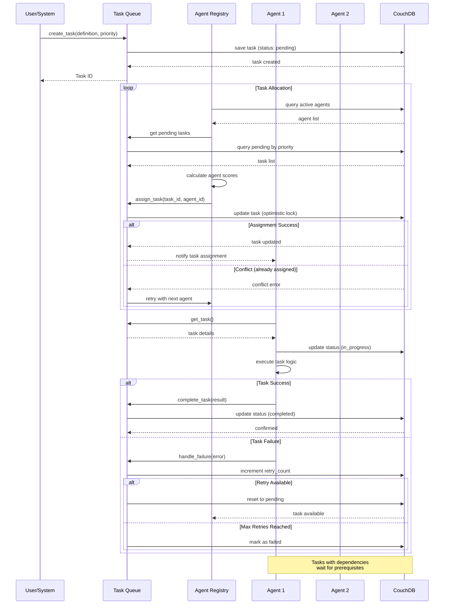

---

## Map-Reduce Coordination

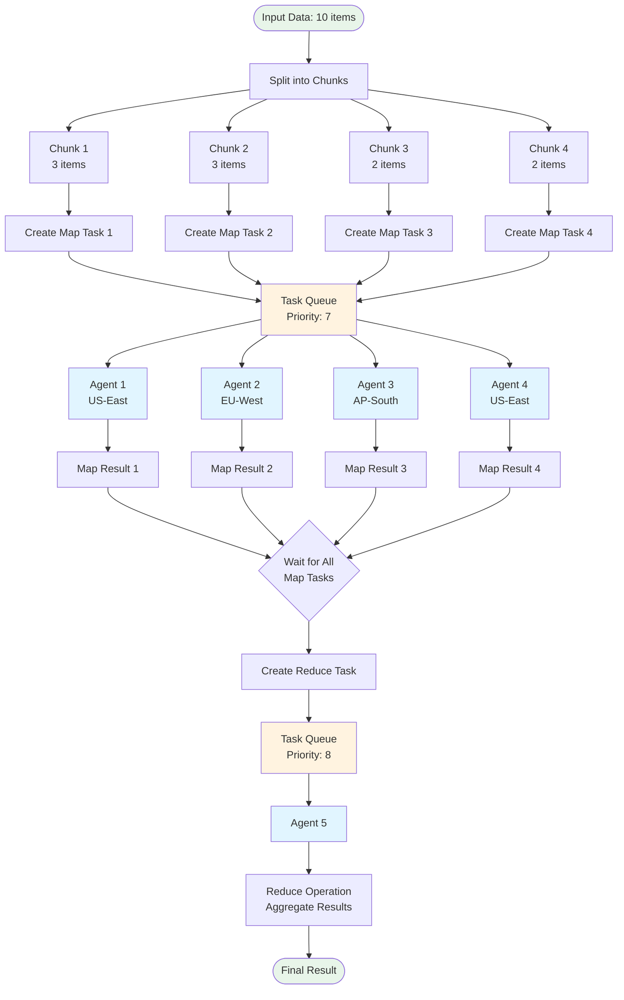

---

## Conflict Resolution

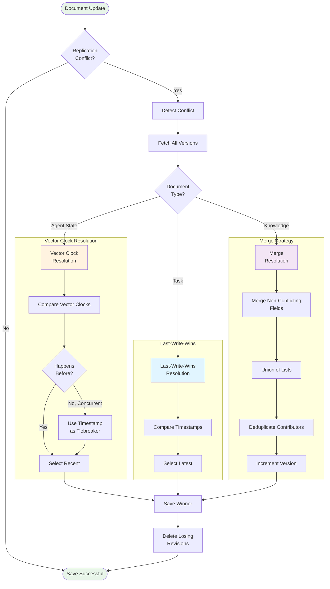

---

## Data Model

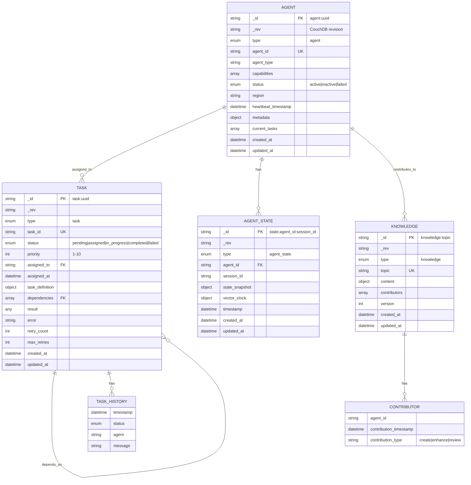

---

## Component Interaction

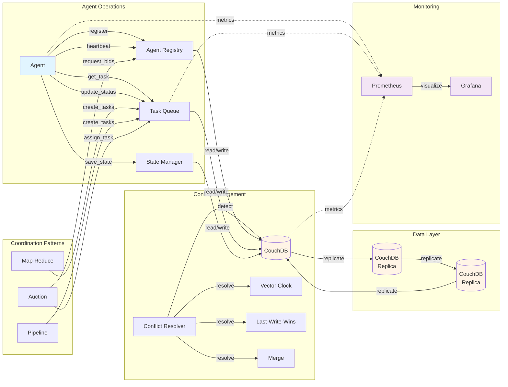

---

## Replication Flow

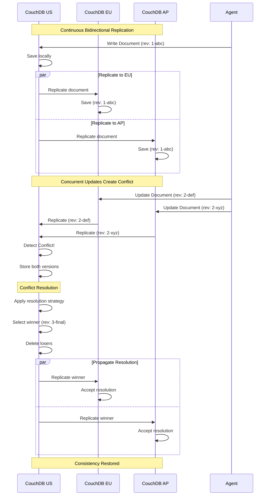

---

## Task Dependency Resolution

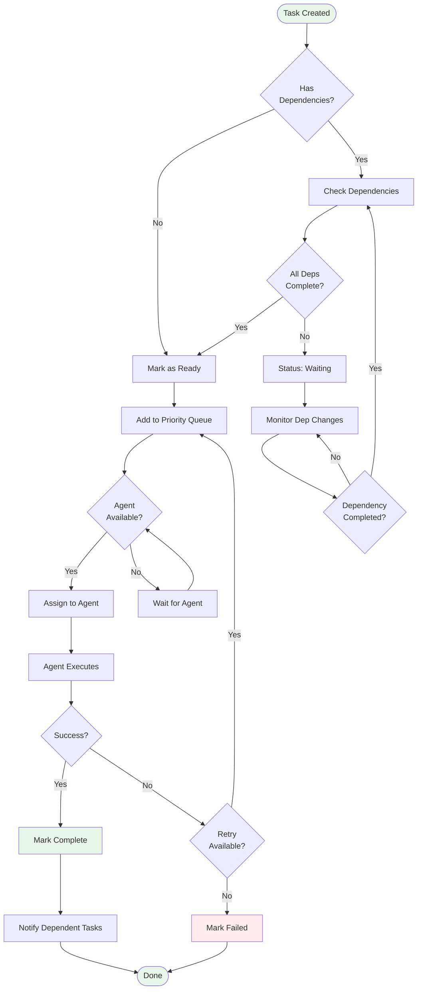

---

## Monitoring Architecture

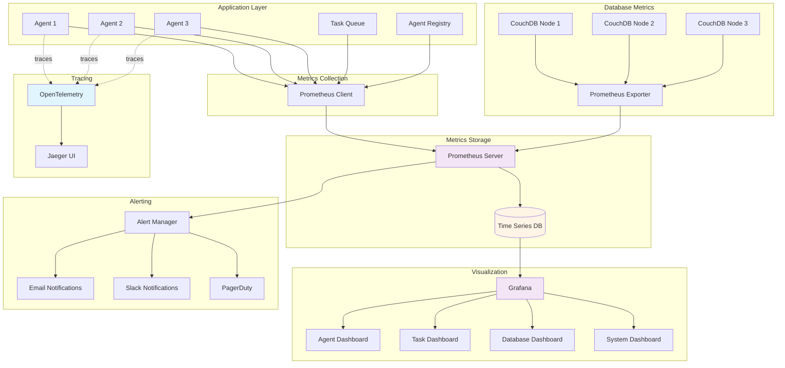

---

## Network Partition Handling

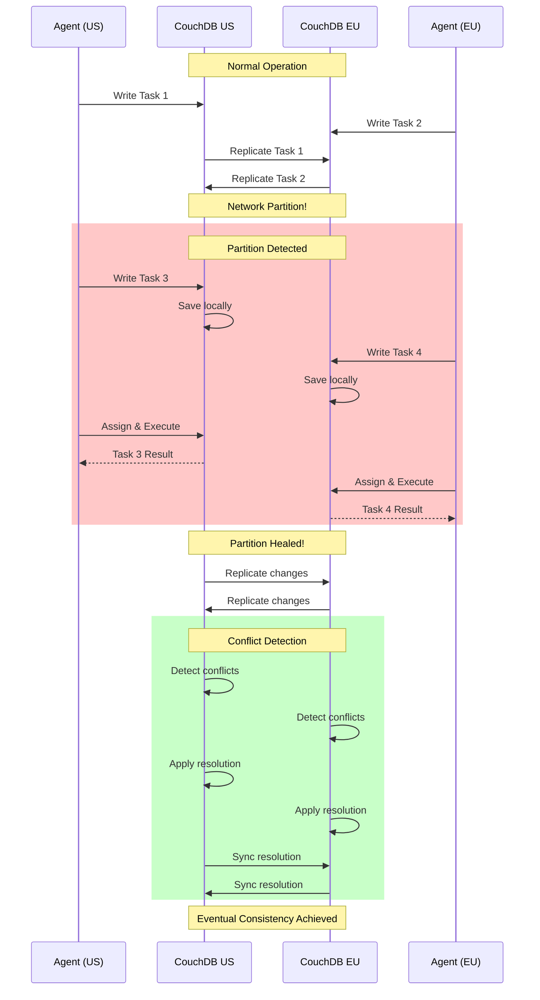

---

## Performance Optimization

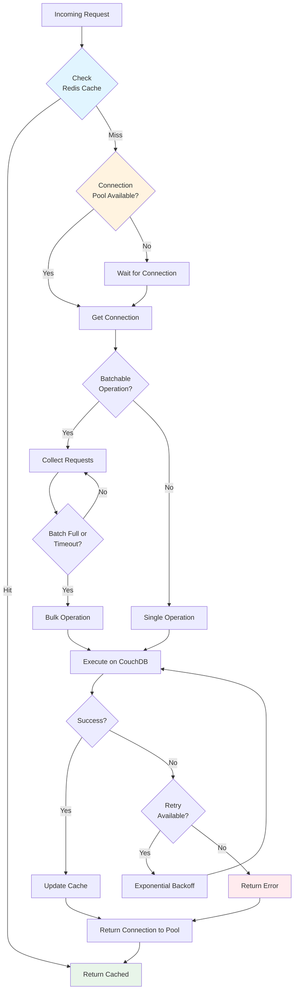

---

## Deployment Architecture

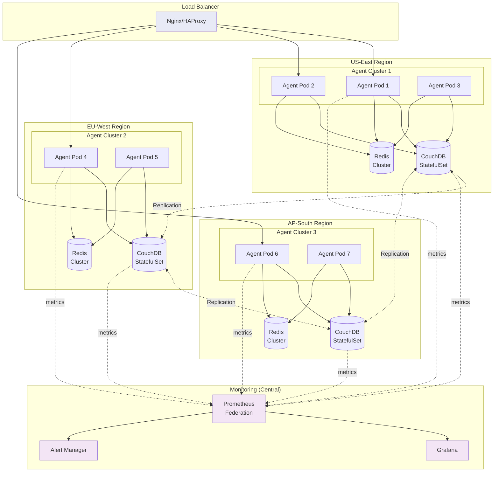

